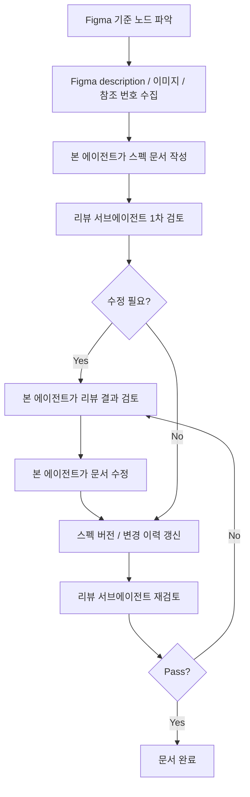

# Spec Document Pipeline

## 목적

이 문서는 Figma 기반 스펙 문서를 작성하고, 서브에이전트 리뷰를 거쳐, 본 에이전트가 수정한 뒤, 다시 서브에이전트로 통과 여부를 확인하는 절차를 정의한다.

목표는 단순히 문서를 예쁘게 쓰는 것이 아니라, Figma의 `description`, 화면 이미지, 참조 번호, sitemap 메모를 근거로 스펙 문서의 정확도를 반복 검증하는 것이다.

## 참여 역할

| 역할 | 책임 |
|---|---|
| 본 에이전트 | Figma를 읽고 스펙 문서를 작성/수정한다. 서브에이전트 리뷰 결과를 판단해 실제 문서에 반영한다. |
| 리뷰 서브에이전트 | `Spec Document Reviewer Agent` 지침에 따라 스펙 문서를 읽기 전용으로 검토한다. 파일은 수정하지 않는다. |
| 사용자 | 문서 방향, 가독성, 정책 결정이 필요한 항목을 최종 판단한다. |

관련 문서:

| 문서 | 용도 |
|---|---|
| `/Users/yuhohyeon/Desktop/project/LinkIt-KMP/docs/agents/spec-document-reviewer.md` | 리뷰 서브에이전트 지침 |
| `/Users/yuhohyeon/Desktop/project/LinkIt-KMP/docs/specs/main-screen.md` | 메인화면 스펙 문서 예시 |

## 전체 흐름



## 단계별 절차

### 1. Figma 기준 수집

본 에이전트는 먼저 Figma URL과 기준 node를 확인한다.

확인할 것:

| 항목 | 설명 |
|---|---|
| Figma URL | 디자인 파일과 기준 노드 |
| node id | 화면 또는 section 단위 node |
| description | 디자이너가 적은 정책/동작 설명 |
| 화면 상태 이미지 | 한 이미지가 어떤 상태를 나타내는지 |
| 참조 번호 | `2-1`, `3-1` 같은 정책 참조 이미지 |
| sitemap 메모 | 화면 전환, 탭, 검색, 프로필 등 상위 흐름 |

산출물:

| 산출물 | 예시 |
|---|---|
| Figma metadata/context | `.figma-workspace/metadata.xml`, `.figma-workspace/main_design_context.txt` |
| 캡처 이미지 | `docs/specs/assets/main-default.png` |
| 참조 이미지 | `docs/specs/assets/main-marker-overlap.png` |

### 2. 본 에이전트가 스펙 문서 작성

문서는 사람이 먼저 읽기 쉬워야 하고, 후반부에는 개발/AI가 쓸 수 있는 표 형태의 상세 명세가 있어야 한다.

권장 구조:

| 순서 | 섹션 | 목적 |
|---|---|---|
| 1 | 한눈에 보기 | 화면의 역할과 핵심 UX 요약 |
| 2 | 화면 상태별 읽기 | 이미지별 상태 설명 |
| 3 | 핵심 UX 규칙 | 구현 전 알아야 하는 정책 압축 |
| 4 | 참조 정책 이미지 | Figma 참조 번호/정책 이미지 해석 |
| 5 | 사용자 흐름 | 실제 액션 기준 흐름 |
| 6 | 상세 기능 명세 | 요소별 feature, trigger, result |
| 7 | 데이터 모델 초안 | 구현 편의를 위한 추론 모델 |
| 8 | 미정/정책 필요 | 확정되지 않은 항목 격리 |
| 9 | 변경 이력 | 스펙 버전, 변경 날짜, 변경 사항 기록 |

작성 원칙:

| 원칙 | 설명 |
|---|---|
| Figma 우선 | description에 있는 내용은 빠뜨리지 않는다. |
| 미정 분리 | Figma에 미정/질문형으로 적힌 내용은 확정하지 않는다. |
| 이미지 근접 배치 | 화면 이미지는 해당 상태 설명 바로 아래에 둔다. |
| 상태별 차이 설명 | 같은 지도/바텀시트라도 상태가 다르면 차이를 적는다. |
| 추론 표시 | Figma 근거가 아닌 구현 초안은 추론임을 명시한다. |
| 버전 기록 | 문서를 생성하거나 수정할 때마다 스펙 버전과 변경 이력을 갱신한다. |

### 3. 리뷰 서브에이전트 1차 검토

본 에이전트는 `Spec Document Reviewer Agent` 지침을 서브에이전트에게 전달하고, 스펙 문서를 읽기 전용으로 검토시킨다.

서브에이전트 작업 범위:

| 작업 | 설명 |
|---|---|
| 지침 읽기 | `docs/agents/spec-document-reviewer.md`를 먼저 읽는다. |
| Figma 근거 대조 | description, 이미지, 참조 번호, sitemap과 문서를 비교한다. |
| 이미지 검증 | 문서 이미지 경로가 실제 존재하는지 확인한다. |
| Findings 작성 | severity 기준으로 문제를 정리한다. |
| 최종 판단 | `Pass`, `Pass with Comments`, `Needs Revision` 중 하나로 결론낸다. |

서브에이전트 금지 사항:

| 금지 | 이유 |
|---|---|
| 파일 수정 | 수정 책임은 본 에이전트에게 있다. |
| Figma 미확인 리뷰 | 이 리뷰는 Figma 근거 대조가 목적이다. |
| 미정 항목 임의 확정 | 정책 결정은 문서에서 분리해야 한다. |

### 4. 본 에이전트가 리뷰 결과 검토

본 에이전트는 서브에이전트 결과를 그대로 적용하지 않고, 각 Finding이 실제로 타당한지 다시 확인한다.

판단 기준:

| 질문 | 처리 |
|---|---|
| Figma 근거가 명확한가? | 문서 수정 |
| sitemap과 description이 충돌하는가? | 충돌 관계를 명시하고 정책 필요로 분리 |
| 단순 가독성 제안인가? | 문서 구조를 해치지 않으면 반영 |
| Figma에 없는 새 기능 제안인가? | 반영하지 않음 |
| 기존 문서 방향과 충돌하는가? | 사용자 의도와 문서 목적 기준으로 조정 |

### 5. 본 에이전트가 문서 수정

수정은 리뷰 결과 중 필요한 항목만 반영한다.

수정 예시:

| 문제 | 수정 방향 |
|---|---|
| 확정처럼 쓴 미정 정책 | `정책 필요`, `추론`, `확인 필요`로 낮춘다. |
| sitemap 흐름과 Figma 상태 충돌 | “지도 내 선택”과 “페이지 이동 후보”를 분리한다. |
| CTA 라벨 충돌 | 위치별 라벨 기준을 표로 정리한다. |
| 이미지 ID만 있고 파일명 없음 | `IMG-*`와 실제 파일 경로 매핑표를 추가한다. |
| 데이터 모델이 Figma 근거처럼 보임 | 구현 편의를 위한 추론 초안이라고 명시한다. |

수정 후 본 에이전트가 즉시 확인할 것:

| 확인 | 방법 |
|---|---|
| Markdown 이미지 존재 | 문서의 `` 경로 확인 |
| 이미지 매핑표 파일 존재 | `IMG-*` 매핑 파일 확인 |
| 확정 문구 잔존 여부 | `정책 필요`로 낮춰야 할 문구 검색 |
| 문서 구조 유지 | 사람이 읽는 섹션이 앞에 남아 있는지 확인 |

### 6. 리뷰 서브에이전트 재검토

수정 후에는 먼저 스펙 버전과 변경 이력을 갱신하고, 같은 리뷰어 역할의 서브에이전트에게 재검토를 요청한다.

버전 갱신 기준:

| 상황 | 버전 처리 | 예시 |
|---|---|---|
| 새 문서 생성 | `v0.1.0`으로 시작 | 메인화면 스펙 최초 작성 |
| Figma 근거 누락 보완 | patch 증가 | `v0.1.0` -> `v0.1.1` |
| 화면 상태/feature 추가 | minor 증가 | `v0.1.1` -> `v0.2.0` |
| 문서 구조 대개편 | minor 증가 | `v0.2.0` -> `v0.3.0` |
| 구현 기준으로 확정된 큰 정책 변경 | major 증가 후보 | `v0.x.x` -> `v1.0.0` |

스펙 문서에는 아래 형식의 변경 이력 섹션을 둔다.

```markdown
## 변경 이력

| Version | Date | Author | 변경 사항 | 근거 |
|---|---|---|---|---|
| v0.1.0 | 2026-06-14 | Codex | 최초 작성 | Figma description / 화면 캡처 |
| v0.1.1 | 2026-06-14 | Codex | 뒤로가기 정책을 미정으로 분리, 이미지 매핑표 추가 | 서브에이전트 리뷰 |
```

재검토 포인트:

| 포인트 | 판단 기준 |
|---|---|
| 이전 Findings 반영 | 각 Finding이 실제로 문서에 반영되었는가 |
| 새 문제 발생 여부 | 수정 과정에서 새로운 단정/충돌이 생기지 않았는가 |
| 이미지 경로 | Markdown 이미지와 매핑표 asset이 존재하는가 |
| 변경 이력 | 현재 수정 내용이 버전/변경 이력에 기록되었는가 |
| 최종 판단 | `Pass`이면 완료, 아니면 다시 본 에이전트 수정 단계로 이동 |

### 7. 완료 기준

아래 조건을 만족하면 문서를 완료 상태로 본다.

| 조건 | 설명 |
|---|---|
| 서브에이전트 최종 판단 `Pass` | 남은 Findings가 없어야 한다. |
| 이미지 경로 검증 통과 | 문서 이미지와 매핑 asset이 모두 존재해야 한다. |
| 미정 정책 격리 | 확정되지 않은 정책은 `미정/정책 필요` 섹션에 있어야 한다. |
| 사람용 구조 유지 | 요약, 상태별 이미지, 핵심 UX 규칙이 상세 표보다 먼저 있어야 한다. |
| 구현 추론 분리 | 데이터 모델/구현 제안은 Figma 근거와 구분되어야 한다. |
| 변경 이력 최신화 | 현재 문서 변경 사항이 버전과 날짜를 포함해 기록되어야 한다. |

## 서브에이전트 프롬프트 템플릿

### 1차 리뷰 프롬프트

```text
너는 `{REVIEWER_AGENT_DOC}`에 정의된 Spec Document Reviewer Agent다.

작업:
아래 스펙 문서를 Figma 근거 기준으로 읽기 전용 검토해라. 파일을 수정하지 말고 리뷰 결과만 반환해라.

검토 대상:
- 에이전트 지침: `{REVIEWER_AGENT_DOC}`
- 스펙 문서: `{SPEC_DOCUMENT_PATH}`
- Figma URL: `{FIGMA_URL}`
- 기준 node: `{FIGMA_NODE_ID}`
- Figma 근거 자료:
  - `{FIGMA_METADATA_PATH}`
  - `{FIGMA_DESIGN_CONTEXT_PATH}`
  - `{SITEMAP_PATH}`
- 이미지 디렉터리: `{IMAGE_DIRECTORY}`

검토 방식:
1. 에이전트 지침 문서를 먼저 읽어라.
2. 스펙 문서와 Figma 추출 자료를 대조해라.
3. 특히 Figma description, 참조 이미지 번호, 이미지 상태별 의미, sitemap 흐름이 문서에 제대로 반영됐는지 확인해라.
4. 이미지 경로가 절대 경로이며 실제 파일이 존재하는지도 확인해라.
5. Findings를 severity 순서로 작성해라.

중요:
- 절대 파일 수정하지 마라.
- Figma에 없는 추론을 확정처럼 쓴 부분은 반드시 지적해라.
- Figma에 명시된 내용이 빠졌으면 누락으로 잡아라.
- 최종 판단은 `Pass`, `Pass with Comments`, `Needs Revision` 중 하나로 내려라.
```

### 수정 필요성 판단 프롬프트

```text
너는 `{REVIEWER_AGENT_DOC}`에 정의된 Spec Document Reviewer Agent다.

작업:
이전 리뷰 Findings를 기준으로, `{SPEC_DOCUMENT_PATH}`에 실제 수정이 필요한지 검토하고, 필요하다면 수정 방향을 구체적으로 제안해라. 파일은 절대 수정하지 마라.

이전 리뷰의 주요 Findings:
{PREVIOUS_FINDINGS}

출력:
- 수정 필요 여부: Yes/No
- 수정해야 할 항목별로 `대상 섹션`, `현재 문제`, `권장 변경`, `수정 후 기대 효과`를 표로 작성
- 수정하지 않아도 되는 항목이 있으면 이유를 적어라
- 최종적으로 본 에이전트가 적용할 수 있는 짧은 패치 계획을 작성

중요:
- 파일 수정 금지
- Figma 근거 없는 새 기능 제안 금지
- 문서가 사람 보기 쉬운 구조를 유지하는 방향으로 제안
```

### 재검토 프롬프트

```text
너는 `{REVIEWER_AGENT_DOC}`에 정의된 Spec Document Reviewer Agent다.

작업:
본 에이전트가 이전 Findings를 반영해 수정한 `{SPEC_DOCUMENT_PATH}`를 재검토해라. 파일은 수정하지 말고, 남은 수정 필요 여부만 판단해라.

재검토 포인트:
{RECHECK_POINTS}

출력:
- 최종 판단: `Pass`, `Pass with Comments`, `Needs Revision` 중 하나
- 남은 Findings가 있으면 severity 표로 작성
- 수정 불필요하면 그 이유를 간단히 작성

중요:
파일 수정 금지.
```

## 실제 적용 예시: 메인화면 스펙

이번 메인화면 스펙에서는 아래 순서로 진행했다.

| 단계 | 수행 내용 | 결과 |
|---|---|---|
| 1 | Figma 메인화면 영역, description, 참조 이미지, sitemap 확인 | 메인화면 스펙 초안 작성 |
| 2 | 리뷰 서브에이전트 1차 검토 | `Needs Revision` |
| 3 | 본 에이전트가 Findings 검토 | 수정 필요 판단 |
| 4 | 수정 필요성 판단 서브에이전트 실행 | 수정 필요 `Yes` |
| 5 | 본 에이전트가 문서 수정 | 정책/미정/라벨/이미지 매핑 보강 |
| 6 | 스펙 버전/변경 이력 갱신 | 리뷰 반영 내용 기록 |
| 7 | 재검토 서브에이전트 실행 | `Pass` |
| 8 | 본 에이전트가 이미지 경로 검증 | Markdown 이미지 11개, 매핑 asset 11개 존재 확인 |

반영된 주요 수정:

| 항목 | 수정 내용 |
|---|---|
| 뒤로가기/지도선택 정책 | 확정 문장에서 `정책 필요`로 분리 |
| 마커/영역 선택 -> 일정 상세페이지 | sitemap 기반 흐름과 지도 내 선택 상태의 관계를 미정으로 정리 |
| CTA 라벨 | `일정에서 보기`와 `지도에서 보기`를 위치별로 구분 |
| 이미지 매핑 | `IMG-01`~`IMG-11`과 실제 asset 파일 경로 매핑 추가 |
| 데이터 모델 | Figma 직접 근거가 아닌 구현 추론 초안이라고 명시 |

## 체크리스트

파이프라인을 돌릴 때마다 아래를 확인한다.

| ID | 체크 |
|---|---|
| P-01 | Figma description을 먼저 읽었는가? |
| P-02 | 참조 번호와 정책 이미지를 따라갔는가? |
| P-03 | 화면별 캡처 이미지가 문서에 절대 경로로 첨부되었는가? |
| P-04 | 사람용 설명이 상세 feature table보다 앞에 있는가? |
| P-05 | 확정/추론/미정이 구분되어 있는가? |
| P-06 | 서브에이전트 1차 리뷰를 받았는가? |
| P-07 | 본 에이전트가 리뷰 결과를 직접 검토했는가? |
| P-08 | 필요한 수정만 반영했는가? |
| P-09 | 스펙 버전과 변경 이력을 갱신했는가? |
| P-10 | 재검토 서브에이전트가 `Pass`를 냈는가? |
| P-11 | 본 에이전트가 이미지 파일 존재 여부를 최종 확인했는가? |

## 운영 규칙

| 규칙 | 설명 |
|---|---|
| 서브에이전트는 읽기 전용 | 문서 수정은 본 에이전트만 수행한다. |
| Findings는 그대로 적용하지 않음 | 본 에이전트가 Figma 근거와 사용자 의도를 기준으로 재판단한다. |
| `Needs Revision`이면 반복 | 수정 후 재검토를 다시 돌린다. |
| `Pass with Comments`는 판단 필요 | 코멘트가 실제 구현 리스크면 수정하고, 단순 제안이면 남겨둘 수 있다. |
| `Pass` 이후에도 로컬 검증 | 이미지 경로와 파일 존재 여부는 본 에이전트가 마지막으로 확인한다. |
| 모든 문서 변경은 버전 기록 | 스펙 내용, 정책, 이미지 매핑, 미정 항목이 바뀌면 변경 이력에 날짜와 변경 사항을 남긴다. |
